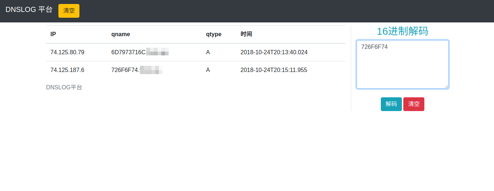
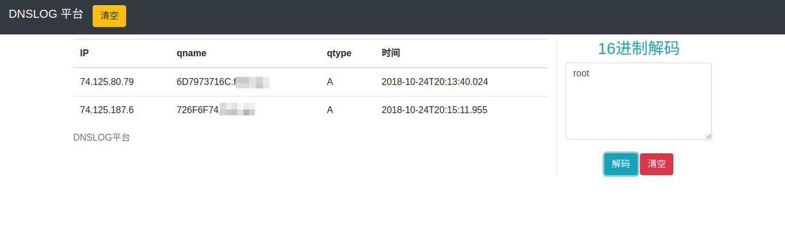

# 說明
DNS Log Server是用來記錄DNS 解析記錄。

本應用啟動前應先啟動DNS Server守護進程, 並進行監聽53端口。
在接收到DNS請求時，會記錄在數據庫中，並返回一個的響應包。
僅在linux環境下運行

# 安裝
```
git clone git@github.com:imjdl/DLS.git
cd DLS
pip install requerments.txt
```
# 使用
1. 啟動DNS服務

     在settings.py 裡將DNSHOST改為你的VPS IP
     
    `python manage.py DNServerd --run start`
2. 遷移數據
    
    `python manage.py migrate`
3. 啟動Web頁面

    `python manage.py runserver 0.0.0.0:8080`

4. 訪問 http://youip:8080

注：執行`python manage.py DNServerd --run stop` 關閉DNS Server

# 更新日誌

2018年10月24日：添加，16進制解碼功能。



# 相關文章

https://blog.0dayhub.ga/2018/10/24/DNS-LOG/
